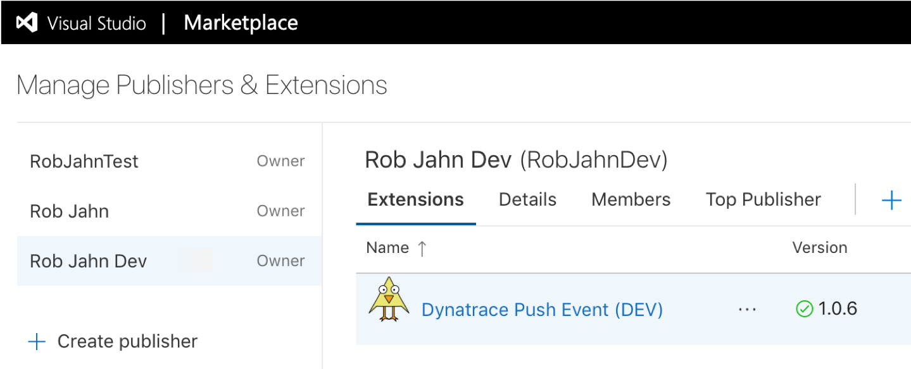

# Overview

This repo contains the soure code and instructions for buulding your an Azure DevOps extention allows you to integrate [Deployment Events](https://www.dynatrace.com/support/help/extend-dynatrace/dynatrace-api/environment-api/events/post-event) into your release pipelines. See the [Extension README](pushEvent/README.md) for an overview of usage and features.

For an overview of the process to develop extensions, read this [Microsoft guide](https://docs.microsoft.com/en-us/azure/devops/extend/get-started/node?view=vsts) and [this blog series](https://devkimchi.com/2019/06/26/building-azure-devops-extension-on-azure-devops-1/). 

You can reach out to rob.jahn@dynatrace.com with questions.

# Build and publish using copy of the REPO

_**NOTE: The instructions and helper scripts assume MacOS.**_

## Prerequisites

1. Create or have access to add extenstions to a [Azure DevOps account](https://visualstudio.microsoft.com/team-services/)

1. Create Azure Marketplace publisher account - See this [Microsoft guide](https://docs.microsoft.com/en-us/azure/devops/extend/develop/add-build-task?view=vsts#createpublisher) for help

## Development environment

1. [Install Node](https://nodejs.org/en/download/package-manager/#macos)

1. Install an IDE. I use [Visual Studio Code](https://code.visualstudio.com/)

## Project setup

1. Copy this repo so that you can adjust for your needs.  The file structure is as follows:

* ```pushEvent/v[x]``` contains the extension source by major version
* ```pushEvent/v[x]/tests``` Mock unit tests that use the 'azure-pipelines-task-lib/mock-test' module
* ```scripts/``` bash scripts used to compile, test and publish the extension
* ```scripts/extension-packages``` where the compiled extension archive files are placed
* ```scripts/json-backup``` backup of the JSON files that are updated by the publishing script

_NOTE: These commands have already been done and the resulting files are already in this repo, but 
for your reference these were commands used during project creation as taken from the [Microsoft guide](https://docs.microsoft.com/en-us/azure/devops/extend/develop/add-build-task?view=azure-devops#step-1-create-the-custom-task)_

```
npm install azure-pipelines-task-lib --save
npm install @types/node --save-dev
npm install @types/q --save-dev
npm install --save requests
npm install -g typescript
npm install -g tfx-cli
tsc --init
```

1. Edit ```pushEvent/vss-extension.json``` and ```pushEvent/src/v[x]/task.json```files with your values for id, name, publisher, and other attributes as needed.

1. Adjust the ```pushEvent/icon.png``` for the extension icon.  This need to be 128x128 pixels.

1. Adjust the ```pushEvent/src/v[x]/icon.png```  for the task icon.  This need to be 128x128 pixels.

1. Replace the ```ID``` value in  ```pushEvent/src/v[x]/task.json```.  Use the [GUID generator](https://www.guidgen.com) to get an unique value


## Development and testing

This assumes you have a Dynatrace tenant and some monitored application that has tags.  Below are
instructions for editing the input files with this information.

The ```pushEvent/src/v[x]/tests/_suite.ts``` test suite file defines the tests that will send events the defined
Dynatrace enviromment.  To make the test work, follows these steps:

1. Copy the test inputs template and adjust the values for your Dynatrace environment

    ```
    cd pushEvent/src/v[x]/tests/input-files
    cp test-inputs.json.template test-inputs.json
    # edit test-inputs.json with your Dynatrace URL and API Token values
    ```

1. Edit the ```pushEvent/src/v[x]/tests/input-files/tagRule.txt``` file as to match some Dynatrace monitored service.

1. Optionally, edit the ```pushEvent/src/v[x]/tests/input-files/customProperties.txt``` for testing.

1. Review and use the provided script to compile and run the mocha test suite.

    ```
    cd scripts
    ./compile.sh
    ```

## Publication setup

Each extention needs a unique version and needs to be a "vsix" archive file that is uploaded to the Microsoft Marketplace. The ```scripts/publish.sh``` script is provided to update the json files, compile the extension and publish it.

1. Create a DevOps personal access token.  See this [Microsoft guide](https://docs.microsoft.com/en-us/azure/devops/organizations/accounts/use-personal-access-tokens-to-authenticate?view=azure-devops).

1. First copy the publish inputs template and adjust the values for your Extension. (Version, Publisher, Personal Access token, Extension Name)

    ```
    # cd into the root project folder
    cp publish-inputs.sh.template publish-inputs.sh
    # edit publish-inputs.sh
    ```

1. Run the publish script

    ```
    cd scripts
    ./publish.sh
    ```

    _** NOTE: The publish shell script assumes three publishers for DEV, TEST, and PROD where DEV and TEST are private and PROD is public. So, adjust the script and variables to meet you needs.**_

1. Verify the published extension in the [Marketplace](https://marketplace.visualstudio.com/manage/publishers). It should look something like this

    


## Versioning

1. The conversion is ```Major.Minor.Patch``` and there are two versions in this project.  
    * ```vss-extension.json``` this is overall extension version and needs to be updated every new publish
      * the ```tfx extension publish --rev-version``` flag updates the patch number in the files automatically
      * manually adjust if want to update 'Major' or 'Minor' version number and change the 'Patch' number back to zero.
    * ```task.json``` this is the task level version that shows up in Azure DevOps pipeline page
      * manually adjust the 'Minor' and 'Patch' number for changes

1. For a change to the task 'Major' version
    * copy the /src/v[x]/ folder to the next version
    * revert the version number to x.0.0
    * once published, the task version drop down in Azure DevOps shows ```1.*, 2.*, etc.```

1. Any version updates to an extension will automatically install the new version to the Azure DevOps orgs where it is installed.  It make take a minute or two to propogate.

1. Adding this attribute to the task.json file will be marked in [Azure DevOps](https://github.com/microsoft/azure-pipelines-tasks/blob/master/docs/deprecatedtasks.md) as DEPRECATED.
    ```
    "deprecated": true,
    ```

1. for a 'private' publisher, you can delete and extension but will be deleted from any pipeline it is 
installed in and break the pipeline.

1. for a 'public' published, you must contact MS support to delete.  One can 'unpublish' the extension
but it is still viewable in the market place.  Once can use the 'deprecated' flag as another option.