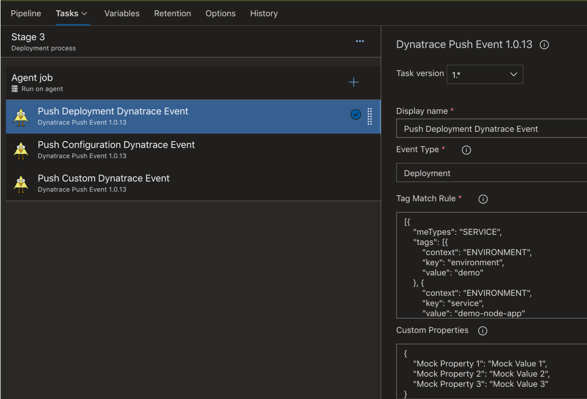

# Overview

Azure DevOps extention allows you to integrate [Deployment Event](https://www.dynatrace.com/support/help/extend-dynatrace/dynatrace-api/environment-api/events/post-event) into your release pipelines. 

The extension supports the following event types, so a number of use cases can be supported.
1. **deployment event** - used when code is deployed
2. **configuration event** - used when configuration change is perfomed
3. **custom event** - general purpose event. could be used for events like performance test start or stop

_**DISCLAIMER:** The marketplace extension is intended for demonstration purposes. This is not developed
or supported by Dynatrace. That said, feel free to install the extension and try it out.  To incorporate these
extensions into your environment, a developer should fork this repo as to make it organizational specific.  See the [Developer Notes] section below for details.  You can reach out to rob.jahn@dynatrace.com with questions._

# Install the extension

1. Goto [Azure extension marketplace](https://marketplace.visualstudio.com/azuredevops)
1. Search for ```"Dynatrace Push Event"``` 
1. Click on the ```"Get it for free"``` button to install to your Azure DevOps organization
1. Once installed it should look like this

    

# Add push event task to your pipeline

Within a release pipeline, use the drop down to choose the ```Event Type``` and give the task a name such as ```Push Dynatrace Deployment Event```.

  

Many of the arguments defaults to builtin DevOps pipeline variables, but you can adjust these for your needs. Use the ```custom properties``` field to add in custom information.
 
You need to define variables for the Dynatrace tenant and API Token. 
1. _**dynatraceTenantUrl**_ = (YOUR TENANT) e.g. https://(YOUR TENTANT).live.dynatrace.com
1. _**dynatraceApiToken**_ = (YOUR TOKEN)

Use a variable group as shown here for re-use across pipelines and be sure to set the valies and as hidden.

Refer to the Dynatrace [Deployment Event Documentation](https://www.dynatrace.com/support/help/extend-dynatrace/dynatrace-api/environment-api/events/post-event) for the ```TagMatchRule``` specification and examples.

  

Once you have a variable group, link it to the pipeline.


# Viewing an Event

The events can be viewed within Dynatrace as shown here on the services page.  Below is an example of a mocked deployment event.

