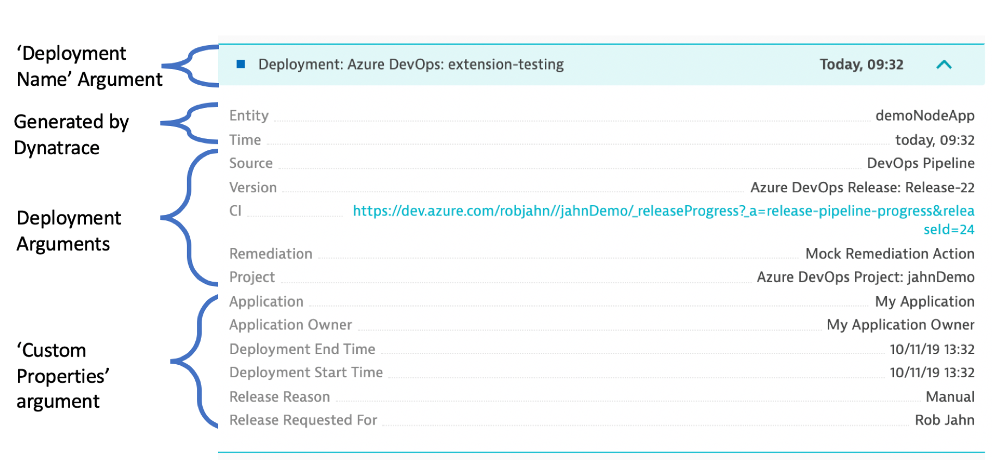

# Overview

Azure DevOps extention allows you to integrate [Deployment Event](https://www.dynatrace.com/support/help/extend-dynatrace/dynatrace-api/environment-api/events/post-event) into your release pipelines. 

The extension supports the following event types, so a number of use cases can be supported.
1. **deployment event** - used when code is deployed
2. **configuration event** - used when configuration change is perfomed
3. **custom event** - general purpose event. could be used for events like performance test start or stop

_**DISCLAIMER: The marketplace extension is intended for demonstration purposes. This is not developed
or supported by Dynatrace. That said, feel free to install the extension and try it out.  To incorporate these
extensions into your environment, checkout this. [GitHub repo](https://github.com/dt-demos/azure-devops-extension-dt-push-event)._


# Install the extension

1. Goto [Azure extension marketplace](https://marketplace.visualstudio.com/azuredevops)
1. Search for ```"Dynatrace Push Event"``` 
1. Click on the ```"Get it free"``` button to install to your Azure DevOps organization
1. Once installed it should look like this

    

# Add push event task to your pipeline

Within a release pipeline, use the drop down to choose the ```Event Type``` and give the task a name such as ```Push Dynatrace Deployment Event```.


You need to define variables for the Dynatrace tenant and API Token. 
1. _**dynatraceTenantUrl**_ = (YOUR TENANT) e.g. https://(YOUR TENTANT).live.dynatrace.com
1. _**dynatraceApiToken**_ = (YOUR TOKEN)

Use a variable group as shown here for re-use across pipelines and be sure to set the valies and as hidden.

## Dynatrace configuration


Once you have a variable group, link it to the pipeline.


## Arguments

Many of the arguments defaults to builtin DevOps pipeline variables, but you can adjust these for your needs. 

The ```Tag Match Rule``` must conform to value the formated expected for the ```TagMatchRule``` within the [Dynatrace Deployment Event API](https://www.dynatrace.com/support/help/extend-dynatrace/dynatrace-api/environment-api/events/post-event).  Below is an example:

``` 
[{
    "meTypes": "SERVICE",
    "tags": [{
        "context": "ENVIRONMENT",
        "key": "environment",
        "value": "demo"
    }, {
        "context": "ENVIRONMENT",
        "key": "service",
        "value": "demo-node-app"
    }]
}]
```

The ```Custom Properties``` is an optional field to add in custom information.  Use this to set
your information for the application, deployment or configuration change.

Below is an example for a deployment event:

```
{
    "Deployment Start Time": "$(DeploymentEventStartTime)",
    "Deployment End Time": "$(DeploymentEventEndTime)",
    "Application": "$(Application)",
    "Application Owner": "$(ApplicationOwner)",
    "Release Reason": "$(Release.Reason)",
    "Release Requested For": "$(Release.RequestedFor)",
    "Release Description": "$(Release.ReleaseDescription)"
}
```

# Viewing an Event

The events are viewed within Dynatrace on the services, process or hosts page.  

The example below is a _**Deployment**_ event with the ```Custom Properties``` set from the example above.


